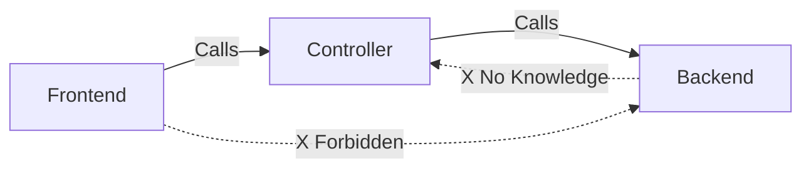

# AI 코딩 규칙 및 가이드라인 (Rules)

이 파일은 이 프로젝트에서 작업할 때 AI가 **반드시 준수해야 하는 최상위 규칙(Meta-Rules)**을 정의합니다.

## 0. 언어 및 커뮤니케이션 규칙 (Language & Communication)

**모든 상호작용의 기본 언어는 한국어(Korean)입니다.**

1.  **설명 및 대화**: 사용자의 질문이나 명령 언어와 관계없이, AI의 **모든 설명, 답변, 사고 과정(Thought Process) 요약**은 **한국어**로 작성해야 합니다.
2.  **결과물**: 코드 주석, 문서(Markdown), git commit message 등 생성되는 모든 결과물 또한 가능한 한 **한국어**를 기본으로 하되, 기술 용어나 관례적으로 영어가 필수적인 경우(변수명, 특정 기술 문서 등)에는 예외를 둡니다.
3.  **예외**: 사용자가 명시적으로 "영어로 답변해줘"라고 요청하는 경우에만 일시적으로 영어를 사용합니다.

## 1. 백엔드 모듈 작업 규칙 (`backend/*`)

**핵심 원칙 (Core Principle):**
`backend/` 하위의 특정 모듈(디렉토리)에서 작업할 때는, **해당 디렉토리 내에 `AI_CODING_GUIDE.md` 파일이 존재하는지 반드시 확인해야 합니다.**

만약 파일이 존재한다면:
1.  **작업 시작 전**에 해당 가이드를 읽으십시오.
2.  가이드에 명시된 규칙(구조, 명명법, 패턴 등)을 **엄격히 준수**하십시오.
3.  이는 해당 모듈의 일관성을 유지하기 위한 **절대적인 요구사항**입니다.

### 적용 예시

*   **DynamoDB 작업 시:**
    *   경로: `backend/client-dynamodb`
    *   행동: `backend/client-dynamodb/AI_CODING_GUIDE.md` 참조 필수.
*   **WorkerKV 작업 시:**
    *   경로: `backend/worker_kv`
    *   행동: `backend/worker_kv/AI_CODING_GUIDE.md` 참조 필수.
*   **Cloudflare Gateway 작업 시:**
    *   경로: `backend/cloudflare_gateway`
    *   행동: `backend/cloudflare_gateway/AI_CODING_GUIDE.md` 참조 필수.

---
*(이 파일은 프로젝트 전체에 적용되는 상위 헌법입니다. 각 모듈별 세부 법률은 해당 모듈 폴더 내의 가이드 파일을 따릅니다.)*

## 2. 아키텍처 및 의존성 규칙 (Architecture & Dependencies)

이 프로젝트는 **Frontend -> Controller -> Backend** 로 흐르는 단방향 의존성 구조를 엄격히 따릅니다.

### 2.1. 구조 정의 (Structure Definition)

1.  **Backend (`backend/*`)**
    *   **역할**: 가장 순수한 형태의 데이터 처리 메커니즘 및 인프라 로직 (DB 접근, 외부 API 호출 등).
    *   **제약**: `frontend`나 `controller`에 대해 **전혀 몰라야 합니다 (Zero Knowledge).**
    *   **의존성**: 오직 외부 라이브러리나 내부 유틸리티만 import 가능. 상위 레이어 import **절대 금지**.

2.  **Controller (`controller/*`)**
    *   **역할**: 비즈니스 로직 및 유즈케이스(Use Case) 담당.
    *   **동작**:
        *   `backend`의 순수 함수들을 조합하여 비즈니스 목적을 달성합니다.
        *   `frontend`가 호출할 수 있는 "API" 역할을 합니다.
    *   **의존성**: `backend/*`를 import 하여 사용.

3.  **Frontend (`frontend/*`)**
    *   **역할**: **사용자 실행 진입점 (Execution Entry Point)** 및 인터페이스.
        *   이 프로젝트는 **Home Server** 성격이 강하므로, 웹 UI뿐만 아니라 **사용자가 직접 실행하는 `.tsx` 스크립트, CLI 도구** 등을 모두 포함합니다.
    *   **제약**:
        *   **반드시 `controller` 함수만을 호출**하여 작업을 수행해야 합니다.
        *   `backend` 로직을 직접 import 하거나 호출하는 것은 절대 금지입니다.
    *   **의존성**: `controller/*`를 import 하여 사용.

### 2.2. 요약 다이어그램

