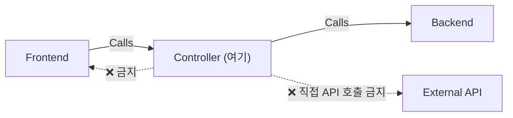

# 컨트롤러 모듈 제작 가이드 (Controller Module Creation Guide)

이 문서는 `controller` 디렉토리에 새로운 모듈을 추가할 때 따라야 할 **표준 절차와 규칙**을 정의합니다.
컨트롤러는 `backend`의 순수 함수들을 **조합**하여 **비즈니스 로직(Use Case)**을 구현하는 계층입니다.

---

## 1. 컨트롤러의 역할 (Role)

| 항목 | 설명 |
| :--- | :--- |
| **핵심 역할** | Backend 함수들을 조합하여 하나의 비즈니스 목적을 달성하는 **Use Case 함수** 제공 |
| **호출 대상** | `backend/*`의 export 함수만 import 가능 |
| **호출자** | `frontend/*`에서만 호출됨 |
| **금지 사항** | `frontend` import 절대 금지. 직접적인 외부 API 호출 금지 (반드시 backend를 거칠 것) |



---

## 2. 표준 구조 (Standard Structure)

```
controller/<use_case_name>/
├── AI_CODING_GUIDE.md     <-- [필수] 해당 유즈케이스의 "헌법" (Local Laws)
├── _.ts                   <-- [필수] 진입점 — export 함수 정의
└── note/
    └── _.ts               <-- [필수] 실행 연습장 (Playground)
```

> **핵심**: 컨트롤러의 `_.ts`는 **export 함수**를 정의합니다. Frontend가 이 함수를 import하여 실행합니다.

---

## 3. 단계별 제작 절차 (Step-by-Step)

1.  **폴더 생성**: `controller/<use_case_name>` (예: `controller/summarize_news`)
2.  **가이드 작성 (`AI_CODING_GUIDE.md`)**:
    *   이 컨트롤러가 **어떤 비즈니스 목적**을 달성하는지 서술합니다.
    *   **사용하는 Backend 모듈 목록**을 명시합니다.
    *   **Function List**: export하는 함수와 그 역할, 파라미터, 반환값을 나열합니다.
    *   **Usage**: Frontend에서 어떻게 호출하는지 예제를 포함합니다.
3.  **핵심 함수 구현 (`_.ts`)**:
    *   Backend 함수들을 import하여 비즈니스 로직을 조합합니다.
    *   반드시 **export function** 형태로 외부에 노출합니다.
4.  **연습장 작성 (`note/_.ts`)**:
    *   실제 동작을 눈으로 확인하는 공간입니다.

---

## 4. 코드 템플릿

### 진입점 (`_.ts`)

```typescript
// controller/summarize_news/_.ts
import { searchArticles } from "../../backend/rapidapi/news-api14/search_articles/_";
import { requestGeminiFlash } from "../../backend/gemini/flash_2_0/_";
import { createDeeplink } from "../../backend/coupang/deeplink/_";

/**
 * 뉴스를 검색하고 AI로 요약한 뒤, 관련 상품 딥링크를 첨부하여 반환합니다.
 * @param keyword - 검색 키워드
 * @param productUrl - 관련 쿠팡 상품 URL
 * @returns 요약된 뉴스 + 딥링크
 */
export async function summarizeNewsWithProduct(
  keyword: string,
  productUrl: string
): Promise<{ summary: string; deeplink: string } | null> {
  // 1. 뉴스 검색 (backend)
  const articles = await searchArticles({ query: keyword, limit: 5 });
  if (!articles || articles.length === 0) return null;

  // 2. AI 요약 (backend)
  const prompt = `다음 뉴스들을 한국어로 3줄 요약해줘:\n${articles.map(a => a.title).join("\n")}`;
  const summary = await requestGeminiFlash(prompt);
  if (!summary) return null;

  // 3. 딥링크 생성 (backend)
  const link = await createDeeplink({ coupangUrls: [productUrl] });

  return {
    summary,
    deeplink: link?.shortenUrl ?? productUrl,
  };
}
```

### 연습장 (`note/_.ts`)

```typescript
// controller/summarize_news/note/_.ts
import dotenv from "dotenv";
import { summarizeNewsWithProduct } from "../_";

dotenv.config();

;(async () => {
    console.log("=== Controller Playground: summarize_news ===");

    const result = await summarizeNewsWithProduct(
        "AI 반도체",
        "https://www.coupang.com/vp/products/8370960989"
    );

    console.log("Result:", JSON.stringify(result, null, 2));
    process.exit(0);
})();
```

---

## 5. 작성 규칙 요약

| 규칙 | 설명 |
| :--- | :--- |
| **Backend만 import** | `backend/*` 함수만 사용. 직접 axios/fetch 호출 금지 |
| **Frontend 모름** | Controller는 자신을 누가 호출하는지 알 필요 없음 |
| **하나의 Use Case** | 폴더 하나 = 비즈니스 목적 하나. 너무 많은 책임을 넣지 말 것 |
| **순수 조합** | Backend 함수들의 "파이프라인" 역할. 가능한 한 상태를 갖지 않을 것 |
| **export function** | 반드시 함수를 export하여 Frontend가 호출 가능하게 할 것 |
| **dotenv 금지** | Controller `_.ts`에서 `dotenv.config()` 호출 금지. `note/_.ts`에서만 허용 |
