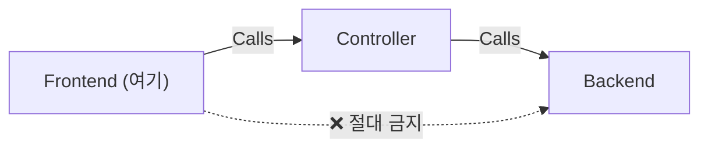

# 프론트엔드 모듈 제작 가이드 (Frontend Module Creation Guide)

이 문서는 `frontend` 디렉토리에 새로운 실행 모듈을 추가할 때 따라야 할 **표준 절차와 규칙**을 정의합니다.
프론트엔드는 **사용자가 직접 실행하는 진입점(Entry Point)**으로, Controller의 함수를 호출하여 작업을 수행합니다.

---

## 1. 프론트엔드의 역할 (Role)

| 항목 | 설명 |
| :--- | :--- |
| **핵심 역할** | 사용자가 **직접 실행**하는 스크립트. Controller를 호출하고 결과를 출력합니다 |
| **호출 대상** | `controller/*`의 export 함수만 import 가능 |
| **금지 사항** | `backend/*` 직접 import **절대 금지** |
| **실행 방식** | `tsx frontend/<모듈>/_.ts` 또는 스케줄러/CLI를 통해 실행 |



---

## 2. 표준 구조 (Standard Structure)

```
frontend/<task_name>/
├── AI_CODING_GUIDE.md     <-- [필수] 해당 태스크의 "헌법" (Local Laws)
└── _.ts                   <-- [필수] 실행 진입점 — IIFE 패턴
```

> **핵심**: 프론트엔드의 `_.ts`는 **즉시 실행(IIFE)** 패턴입니다. `tsx frontend/<task_name>/_.ts`로 바로 실행할 수 있어야 합니다.

---

## 3. 단계별 제작 절차 (Step-by-Step)

1.  **폴더 생성**: `frontend/<task_name>` (예: `frontend/daily_news_summary`)
2.  **가이드 작성 (`AI_CODING_GUIDE.md`)**:
    *   이 스크립트의 **목적**과 **실행 방법**을 서술합니다.
    *   **사용하는 Controller 함수 목록**을 명시합니다.
    *   **실행 명령어**: `tsx frontend/<task_name>/_.ts`
    *   **필요한 환경변수**: 스크립트 실행에 필요한 `.env` 설정을 나열합니다.
3.  **실행 스크립트 작성 (`_.ts`)**:
    *   반드시 **IIFE 패턴** + `process.exit(0)`으로 작성합니다.
    *   Controller 함수를 import하여 호출하고, 결과를 콘솔 또는 파일로 출력합니다.

---

## 4. 코드 템플릿

### 기본형: 단일 Controller 호출

```typescript
// frontend/daily_news_summary/_.ts
import { summarizeNewsWithProduct } from "../../controller/summarize_news/_";
import dotenv from "dotenv";

;(async () => {
    dotenv.config();
    console.log("🚀 [daily_news_summary] 시작...");

    const result = await summarizeNewsWithProduct(
        "AI 반도체",
        "https://www.coupang.com/vp/products/8370960989"
    );

    if (result) {
        console.log("📰 요약:", result.summary);
        console.log("🔗 링크:", result.deeplink);
    } else {
        console.log("❌ 결과 없음");
    }

    console.log("✅ 완료!");
    process.exit(0);
})();
```

### 응용형: 여러 Controller 조합 + 파일 출력

```typescript
// frontend/weekly_report/_.ts
import { summarizeNewsWithProduct } from "../../controller/summarize_news/_";
import { translateToEnglish } from "../../controller/translate_content/_";
import fs from "fs";
import dotenv from "dotenv";

;(async () => {
    dotenv.config();
    console.log("🚀 [weekly_report] 주간 리포트 생성 시작...");

    const keywords = ["AI 반도체", "전기차 배터리", "양자컴퓨터"];
    const results: string[] = [];

    for (const keyword of keywords) {
        console.log(`  📡 처리 중: ${keyword}`);
        const news = await summarizeNewsWithProduct(keyword, "");
        if (news) {
            const translated = await translateToEnglish(news.summary);
            results.push(`## ${keyword}\n${news.summary}\n\n**EN:** ${translated}\n`);
        }
    }

    // 결과를 파일로 저장
    const report = `# 주간 리포트\n\n${results.join("\n---\n\n")}`;
    fs.writeFileSync("./output/weekly_report.md", report, "utf-8");
    console.log("✅ 리포트 저장 완료: ./output/weekly_report.md");

    process.exit(0);
})();
```

### 스케줄링형: cron 연동

```typescript
// frontend/scheduled_crawler/_.ts
import { crawlAndStore } from "../../controller/crawl_products/_";
import cron from "node-cron";
import dotenv from "dotenv";

;(async () => {
    dotenv.config();
    console.log("🕐 [scheduled_crawler] 스케줄러 시작 (매 6시간)...");

    // 즉시 1회 실행
    await crawlAndStore("에어팟");

    // 이후 6시간마다 반복
    cron.schedule("0 */6 * * *", async () => {
        console.log(`⏰ [${new Date().toISOString()}] 크롤링 실행...`);
        await crawlAndStore("에어팟");
    });

    // 스케줄러는 process.exit 하지 않음 (상주 프로세스)
})();
```

---

## 5. 실행 방법

```bash
# 기본 실행
npx tsx frontend/daily_news_summary/_.ts

# 환경변수 포함 실행
npx tsx -r dotenv/config frontend/daily_news_summary/_.ts
```

---

## 6. 작성 규칙 요약

| 규칙 | 설명 |
| :--- | :--- |
| **Controller만 import** | `controller/*` 함수만 사용. `backend/*` 직접 import 절대 금지 |
| **IIFE 패턴 필수** | `(async () => { ... process.exit(0); })();` 형태로 작성 |
| **즉시 실행 가능** | `tsx frontend/<task>/_.ts` 한 줄로 실행 가능해야 함 |
| **결과 출력** | 콘솔 출력 또는 파일 저장으로 실행 결과를 확인 가능하게 할 것 |
| **dotenv 로딩** | 스크립트 시작 시 `dotenv.config()` 호출 필수 |
| **깔끔한 종료** | 일회성 작업은 반드시 `process.exit(0)` 호출. 스케줄러는 예외 |
